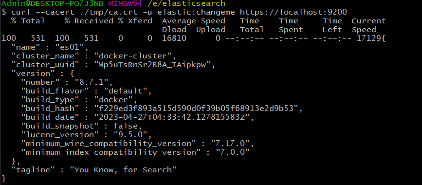
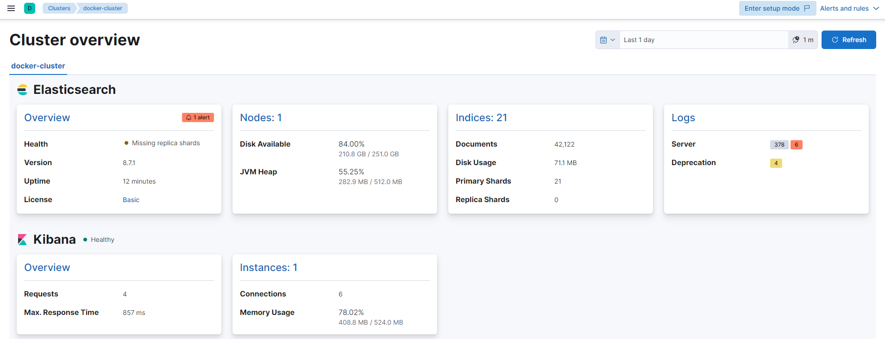
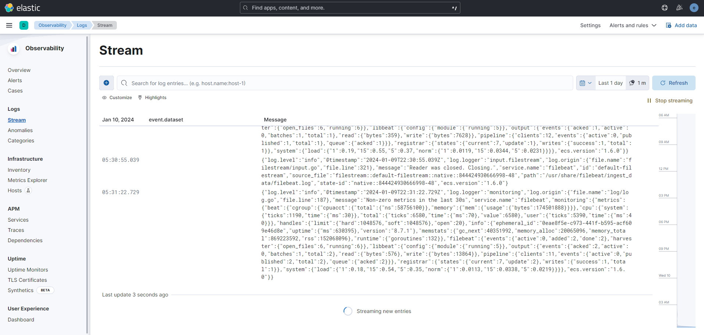
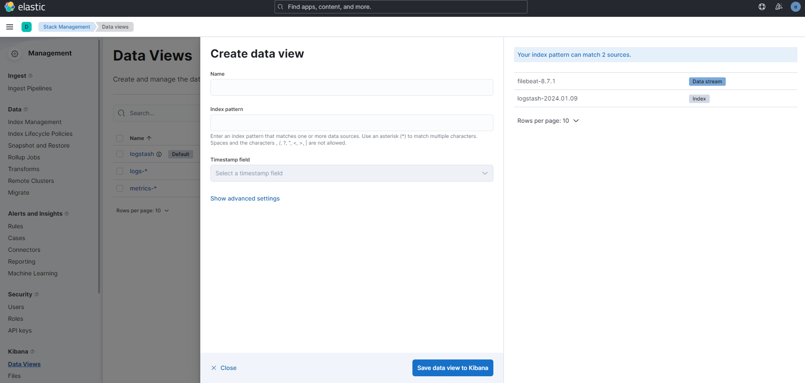
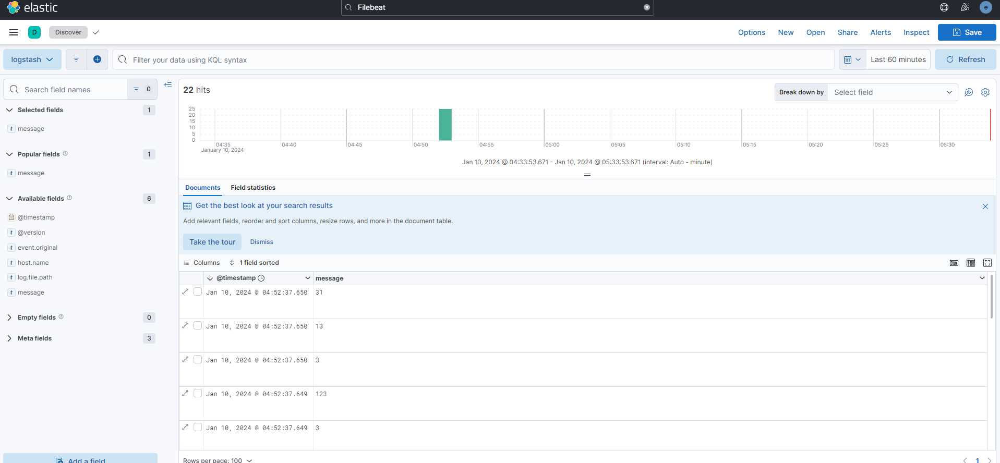
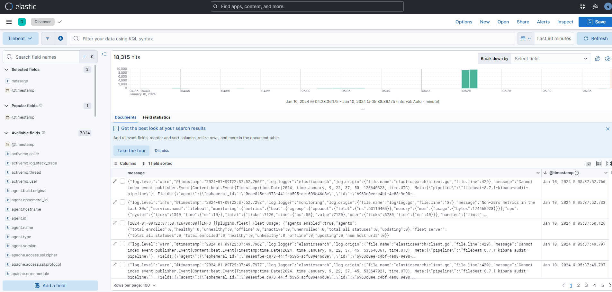

Hướng dẫn:

- https://www.elastic.co/blog/getting-started-with-the-elastic-stack-and-docker-compose
- github: https://github.com/elkninja/elastic-stack-docker-part-one

1. setup chứa cấu hình về security, mặc định 8.0 security được bật
2. config es01, cluster có một node
3. dùng git bash chạy 2 lệnh dưới
4. tạo thư mục tmp, copy ca.crt ra
   - docker cp elasticsearch-es01-1:/usr/share/elasticsearch/config/certs/ca/ca.crt ./tmp/.
5. dùng ca.crt để kết nối vào es
   - curl --cacert ./tmp/ca.crt -u elastic:changeme https://localhost:9200

kết quả:

6. config kibana
7. config metric
   - trên kibana nó ở Stack Monitoring
     
8. config filebeat
   - từ cái thư mục mount ở docker-compose
   - mỗi khi thay đổi file trong đó nó sẽ báo ở Observability/Stream
     
9. config logstat

   - Để ra được cái ảnh như dưới cần vào: Kibana/Data Views, tạo data view
     - 
     - 2 cái index ở bên phải hiện ra khi mình tạo file ở thục mount local (logic của thư mục/file thể hiện tiếp ở docker)
   - Sau khi tạo xong data view có thể vào Discover để chọn mục tương ứng muốn check log
   - logstast 
   - filebeat 

Một số thay đổi so với hướng dẫn

- liên quan đến permission file: https://discuss.elastic.co/t/volume-mapped-filebeat-yml-permissions-from-docker-on-windows-host/91893
  - filebeat -e -strict.perms=false
  - đoạn metric có thể sai, nhưng không hiểu sao nó vẫn chạy
- cầu hình filebeat không qua docker: https://www.youtube.com/watch?v=tGVAkwupH4g

Tiếp theo:

Phần 2: https://www.elastic.co/blog/getting-started-with-the-elastic-stack-and-docker-compose-part-2

- đọc lại sau (đã xem nhưng chưa hiểu được nhiều)
